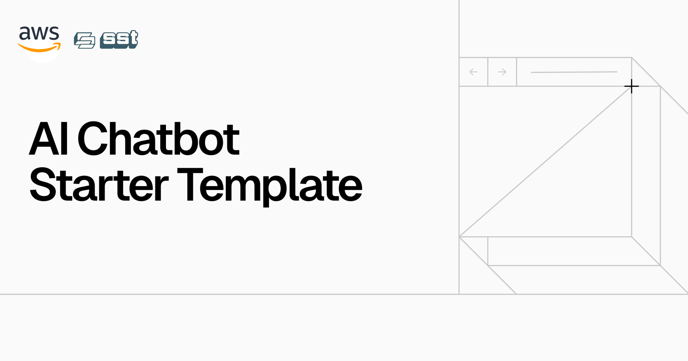

<a href="https://aws-chat-app.serg.tech/">
  
  <h1 align="center">Next.js AI Chatbot on AWS</h1>
</a>

<p align="center">
  An Open-Source AI Chatbot Template Built With Next.js and the AI SDK by Vercel. Deployed on AWS using SST. LLM provider: AWS Bedrock.
</p>

<p align="center">
  <a href="#features"><strong>Features</strong></a> ·
  <a href="#model-providers"><strong>Model Providers</strong></a> ·
  <a href="#deploy-your-own"><strong>Deploy Your Own</strong></a> ·
  <a href="#running-locally"><strong>Running locally</strong></a>
</p>
<br/>

## Features

- [Next.js](https://nextjs.org) App Router
  - Advanced routing for seamless navigation and performance
  - React Server Components (RSCs) and Server Actions for server-side rendering and increased performance
- [AI SDK](https://sdk.vercel.ai/docs)
  - Unified API for generating text, structured objects, and tool calls with LLMs
  - Hooks for building dynamic chat and generative user interfaces
  - Supports AWS Bedrock
- [shadcn/ui](https://ui.shadcn.com)
  - Styling with [Tailwind CSS](https://tailwindcss.com)
  - Component primitives from [Radix UI](https://radix-ui.com) for accessibility and flexibility
- Data Persistence
  - [AMAZON RDS](https://aws.amazon.com/rds/) for saving chat history and user data
  - [AMAZON S3](https://aws.amazon.com/s3/) for efficient file storage
- [NextAuth.js](https://github.com/nextauthjs/next-auth)
  - Simple and secure authentication

## Model Providers

This template ships with OpenAI `gpt-4o` as the default using AWS Bedrock. However, with the [AI SDK](https://sdk.vercel.ai/docs), you can switch LLM providers to [OpenAI](https://openai.com), [Anthropic](https://anthropic.com), [Cohere](https://cohere.com/), and [many more](https://sdk.vercel.ai/providers/ai-sdk-providers) with just a few lines of code.

## Deploy Your Own

We're deploying to AWS using [SST](https://sst.dev/), read more about how to set up your environment variables [here](https://sst.dev/docs/environment-variables).

## Running locally

- Setup your environment variables (see sst.config.ts)

```bash
pnpm install
sst dev
```

Your app template should now be running on [localhost:3000](http://localhost:3000/).
